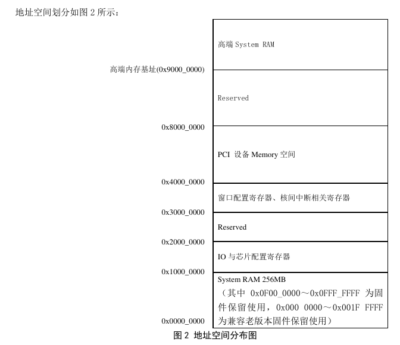

## 一、准备工作

1.https://ftp.gnu.org/gnu/nettle/ v3.5.1 download

2.编译

```
./configure
make -j 8
```

3.创造软链接

```
cd /usr/lib
ln -s [libnettle path] libnettle.so.7
```


```
./configure --prefix=/home/username/Desktop/Os/os-contest/os-loongson/toolchains/gdb-loongarch --host=x86_64-pc-linux-gnu --target=loongarch64-unknown-linux-gnu  --disable-binutils --disable-ld --disable-gold --disable-gas --disable-sim --disable-gprof --disable-werror
```


/usr/bin/ld: cannot find -lboost_regex: No such file or directory

`ld boost-regex --verbose`查看详细信息。发现目标库在下面这几个目录中搜索

```
SEARCH_DIR("/usr/x86_64-pc-linux-gnu/lib64"); SEARCH_DIR("/usr/lib"); SEARCH_DIR("/usr/local/lib"); SEARCH_DIR("/usr/x86_64-pc-linux-gnu/lib");
```

挑选一个地方创建软链接：

```
 ln -s /usr/lib/libboost_regex.so.1.83.0 /usr/lib/libboost_regex.so
```


## 2.龙芯启动，向内核迈进

##### 使用 volatile：

编译器会假定当前程序是系统中唯一可以更改值的部分，并依据此对它进行一些优化。但某些变量可能由其他计算机元素改变，所以这些优化有可能是不合理的。

为了防止编译器优化代码，使用了 `volatile` 关键字。保证该变量能被实时获取。


##### 外设IO端口编址方式

X86 独立编址，使用专门的 IO 指令来执行 IO 操作；LoongArch 内存映射 IO 。

> 内存映射 IO ：统一编址 IO 寄存器和内存存储单元，读写 IO 地址和读写内存地址使用相同的指令来执行。 处理器通过它的状态来限制应用程序可以访问的地址空间。


##### 关于UART

见《Loongson-3A5000-usermanual-v1.03-CN.pdf》第15节。

 

##### 把起始地址安排在 0x0000000000200000 的理由：




##### 两种虚实地址翻译模式

TLB 重填可由硬件或软件进行，例如 X86、 ARM 处理器由硬件完成页表遍历 ( Page Table Walker) , 将所需的页表项填入 TLB中; 而 MIPS、 LoongArch 处理器由异常处理程序进行页表遍历并进行 TLB 填入。

LoongArch 指令系统的 MMU 支持两种虚实地址翻译模式: 直接地址翻译模式和映射地址翻译模式。 

CPU 复位结束后将进入直接地址翻译模式，在直接地址翻译模式下, 物理地址默认直接等于虚拟地址。该模式CSR.CRMD 中的 DA 域为 1 且 PG 域为 0。
映射地址翻译模式 CSR. CRMD 中的 DA 域为 0 且 PG 域为 1。 又分为直接映射地址翻译模式 ( 简称 “ 直接映射模式” ) 和页表映射地址翻译模式 ( 简称“ 页表映射模式” ) 。 优先采用直接映射模式。

直接映射模式通过直接映射配置窗口机制完成虚实地址翻译。LoongArch中共定义了四个直接映射配置窗口，配置信息存于 CSR. DMW0 ~ CSR. DMW3 中, 每个窗口的配置信息包含该窗口对应的地址范围、 该窗口在哪些权限等级下可用以及该窗口上的访存操作的存储访问类型。

页表映射模式, 顾名思义, 通过页表映射完成虚实地址转换。 在该模式下[ PALEN - 1] 位之上的所有位是该位的符号扩展。


##### 存储访问类型

处理器对 IO 空间的访问不能经过 Cache, 因此在使用相同的 load / store 指令既访问 IO 空间又访问内存空间的情况下, 就需要定义 load / store 指令访问地址的 *存储访问类型*,  用来决定该访问能否经过 Cache。

LoongArch 指令集定义存储访问类型 ( Memory Access Type, 简称 MAT) 强序非缓存( Strongly- ordered UnCached, 简称 SUC) 和一致可缓存 ( Coherent Cached, 简称 CC) 分别用于IO 空间和内存空间的访问。 

存储访问类型通常根据访存地址范围来确定。 如果采用页式地址映射方式, 那么同一页内的地址定义为相同的存储访问类型, 通常作为该页的一个属性信息记录在页表项中。

 如果采用段式地址映射方式, 那么同一段内的地址定义为相同的存储访问类型。 LoongArch 指令集可以把直接地址映射窗口的存储访问类型配置为 SUC, 那么落在该地址窗口就可以访问 IO 空间。 


##### CSR

见《龙芯架构参考手册卷一.pdf》第7节。


references:

https://sourceware.org/pipermail/gdb-patches/2021-October/182606.html

https://review.lttng.org/plugins/gitiles/binutils-gdb/+/57f8fe908bec51c40ec686294460ec979b140843%5E%21/

https://stackoverflow.com/questions/16710047/usr-bin-ld-cannot-find-lnameofthelibrary

《计算机体系结构(loongarch)》

[volatile wiki](https://en.wikipedia.org/wiki/Volatile_(computer_programming))